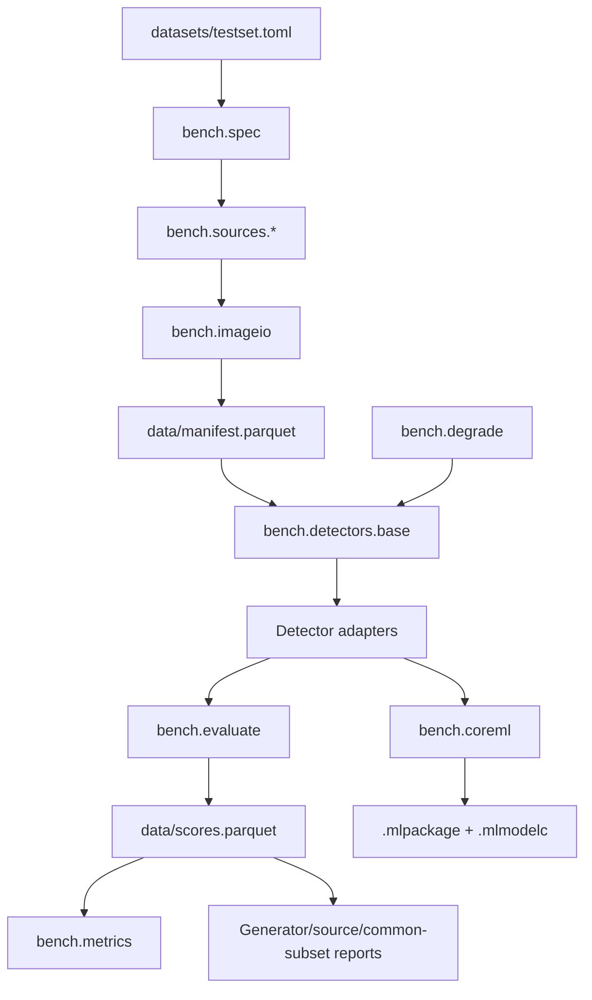

# Benchmark harness

The `bench` package is a manifest-first evaluation system. Downloading, degradation, inference, persistence, and metrics are separate layers so expensive work is resumable and every result retains coverage and evidence provenance.

## Architecture



## Source map

A repository remote is not configured in this workspace, so the paths below are copyable source references rather than links to a guessed host. The surrounding documentation links remain portable when served locally.

### Data contract and loading

| Source path | Responsibility |
|---|---|
| `datasets/testset.toml` | Canonical corpus quotas, budget, sources, licences, filters, caveats, and open questions |
| `bench/spec.py` | Parse and validate the TOML invariants |
| `bench/paths.py` | Repository/data layout and `DEFAIKE_ROOT` override |
| `bench/net.py` | Resumable download, range handling, MD5/SHA-256 checks |
| `bench/imageio.py` | Preserve original bytes, verify decode, determine format, hash content |
| `bench/manifest.py` | Canonical schema, combine, summarize, verify, and prune orphans |
| `bench/sources/sofake.py` | Metadata-first selection and row-group fetching from So-Fake-OOD |
| `bench/sources/rewind.py` | ReWIND archive/path join, AMMeBa exclusion, reference columns |
| `bench/sources/openfaketiny.py` | OpenFakeTiny Reddit split extraction |

### Robustness and quality

| Source path | Responsibility |
|---|---|
| `bench/degrade.py` | Deterministic six-level ladder plus two screenshot rungs |
| `bench/quality.py` | JPEG QF recovery, blockiness, DCT energy, upscale trace, Laplacian variance |
| `bench/metaprobe.py` | EXIF/XMP/C2PA/disclosure **presence** probe, not cryptographic validation |

### Evaluation

| Source path | Responsibility |
|---|---|
| `bench/detectors/base.py` | Detector/score-provider protocols, threaded image preparation, batching |
| `bench/metrics.py` | AUC, balanced accuracy, FPR, conservative `TPR@1%FPR`, ECE, bootstrap CIs |
| `bench/evaluate.py` | Detector×rung scoring, checkpoint/merge/resume, common-subset and slice reports |
| `bench/cli.py` | Typer CLI orchestration |

### Deployment

| Source path | Responsibility |
|---|---|
| `bench/detectors/commfor.py` | Frontier/lowq loading, exact preprocessing, thresholds, contamination guard |
| `bench/coreml.py` | FP16 export, compilation, per-op placement, parity, relative latency |

## Detector adapters

| Selector | Adapter / provider | Notes |
|---|---|---|
| `reference` | `bench/detectors/reference.py` | Six precomputed ReWIND columns; clean only; not project inference |
| `siglip` | `bench/detectors/siglip.py` | Ateeqq two-class SigLIP |
| `clipbased`, `clipdet10k` | `bench/detectors/clipbased.py` | Frozen CLIP ViT-L probes |
| `corvi` | `bench/detectors/corvi.py` | Native-resolution ResNet-50; `--max-side` applies |
| `organika`, `dima806` | `bench/detectors/hf_classifier.py` | Hugging Face classifier presets |
| `commfor`, `commfor-lowq` | `bench/detectors/commfor.py` | Full-coverage frontier and selected lowq variants |
| `dda` | `bench/detectors/dda.py` | DINOv2-L + LoRA ceiling |
| `bfree` | `bench/detectors/bfree.py` | Adapter ready; official weight host unavailable |

`--detectors all` is historical and curated, **not exhaustive**: it omits Corvi for cost and does not currently include commfor or DDA. Explicit selectors should be used for a publishable run.

## CLI reference

| Command | Purpose |
|---|---|
| `bench datasets [--resolved]` | Show declared or measured corpus composition |
| `bench index [--force] [--workers N]` | Build the inexpensive So-Fake metadata index |
| `bench plan` | Preview transfer and retained-byte cost before downloading |
| `bench fetch [--only IDS] [--workers N]` | Download and resolve enabled slices |
| `bench verify` | Non-destructive manifest/filesystem consistency check |
| `bench verify --prune` | **Destructive:** delete orphan image files after verification |
| `bench rungs` | Print the resolution baseline and exact degradation ladder |
| `bench eval ...` | Score selected providers, checkpoint per rung, report metrics |
| `bench probe-metadata` | Measure metadata presence and write the probe table |
| `bench coreml ...` | Export, compile, inspect ANE placement, check parity, time inference |

## Crash safety and score semantics

`bench.evaluate.score()` checkpoints every completed `(detector, rung)` pair. `write_scores()` merges by detector/rung and replaces incoming pairs atomically at table level, so a new rung cannot erase the existing matrix. `--resume` skips completed pairs.

The long-form table includes detector, evidence kind, scored-by-us flag, rung, ID, slice, label, generator, source collection, dimensions, and score. Unsupported or contaminated rows remain `NaN` and are filtered only after coverage is counted.

## M3 acceleration

The detector chooses MPS before CUDA or CPU on this Mac. Inference itself was already accelerated—about 9.3 ms/image on MPS versus 36.5 ms CPU for commfor—but serial degradation dominated wall time. `BaseModelDetector` now uses eight preprocessing threads and a 96-image window:

| Workers | screenshot_shared ms/image | Speedup | Peak RSS |
|---:|---:|---:|---:|
| 1 | 117.4 | 1.00× | 1.28 GB |
| 4 | 30.6 | 3.83× | 1.61 GB |
| 6 | 23.4 | 5.01× | 1.73 GB |
| **8** | **21.6** | **5.42×** | **1.83 GB** |
| 10 | 21.4 | 5.48× | 2.22 GB |

Tests assert exact score equality across worker counts; this is an execution optimization, not a protocol change. `BENCH_WORKERS` overrides the default for other machines.

## Test coverage

The current suite collects **267 tests**. A normal run reports 266 passed and one skipped: the end-to-end Core ML export/placement/parity test is opt-in via `RUN_COREML_TESTS=1`. Unit and regression coverage includes dataset/spec invariants, manifest joins, metrics, detector label semantics, checkpoint merging, contamination, threaded preprocessing, and Core ML normalization/placement logic.

```bash
.venv/bin/python -m pytest -q
RUN_COREML_TESTS=1 .venv/bin/python -m pytest tests/test_coreml.py -q
```

No dedicated network integration suite exists, and the current `network` pytest marker is unused. Those are explicit coverage gaps, not hidden green checks.
