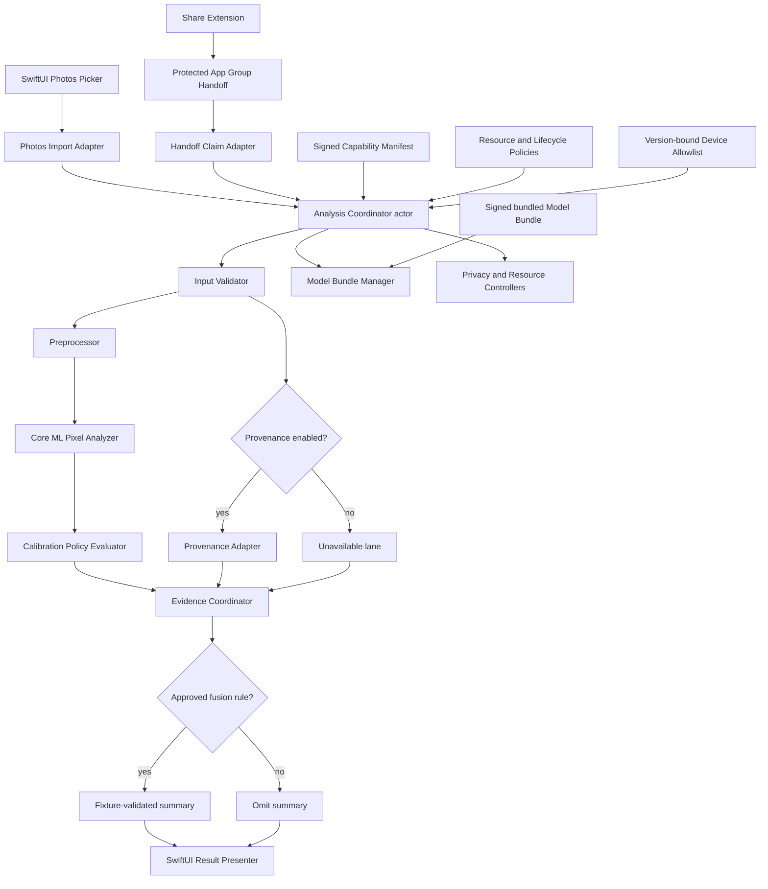

# DefAIke iOS app

DefAIke Version 1 is an iPhone-only, iOS 17-or-later SwiftUI application that evaluates one supported static image for evidence consistent with whole-image AI generation. Pixel inference runs locally against one bundled Core ML model. Content Credential (C2PA) validation is a separate, conditional, offline evidence lane that ships only in one of two capability compositions. Neither lane is ever presented as proof of authenticity, authorship, intent, editing history, or the absence of localized editing.

This section documents the Swift implementation under `ios/`. It is engineering documentation for the app itself, distinct from the [Python benchmark and model-selection evidence](../index.md) that chose the bundled model. For the research and evidence behind the model, see the [shipping model card](../results/shipping-model.md) and the [Core ML deployment gate](../results/coreml.md); this section does not repeat that evidence.

!!! warning "Implemented, not release-ready"
    Every module, adapter, and release-validation script described here exists and passes its own tests. The app is **not** distributable: it has no signed release artifacts, no physical-device evidence, no approved user-facing copy beyond three fixed labels, and two known defects block a working session in one of its two build configurations. See [Implementation status](status.md) for the complete, current ledger.

## What the app does

- Accepts exactly one non-animated JPEG, PNG, or HEIC/HEIF image through the system Photos picker or through the iOS Share Extension.
- Runs the bundled Core ML model on device and calibrates its raw logit into exactly one of three fixed labels: `Signals consistent with AI generation`, `No strong signal detected`, or `Not enough signal`.
- Optionally validates a C2PA Content Credential against the exact analyzed bytes, in the build that links the provenance adapter, and shows that result as an independent evidence lane.
- Never fuses the two lanes into a headline verdict unless a release-approved fusion rule exists for that exact combination; both lane cards stay visible either way.
- Keeps every byte of session data local, ephemeral, and outside analytics, history, and export, and removes it under a versioned cleanup policy at every terminal outcome.
- Shows honest, determinate-only-when-measured progress for work that can take minutes, and stays safely cancelable throughout.

## What it deliberately does not do

No multi-image or batch analysis, no video or audio, no localized-edit or composite detection, no model training, no remote model update, no result persistence or export, and no consumer-facing probability or confidence number. The Share Extension never runs inference; it stages a consented handoff and asks the user to open the app.

## Architecture

The app is a ports-and-adapters design around a pure domain core, so release-controlled behavior is data the domain validates rather than a UI conditional.

- **Domain core** (`DefAIkeDomain`) — immutable evidence types, state transitions, calibration, progress derivation, fusion lookup, and release-artifact schemas. It imports no UI, Photos, Core ML, Image I/O, file-system, or C2PA framework, and depends on no other module.
- **Application orchestration** (`DefAIkeApplication`) — one actor per session binds immutable artifacts, runs ordered stages, joins optional branches, applies cancellation, and commits exactly one terminal outcome.
- **Platform adapters** — PhotosUI/CoreTransferable, `NSItemProvider`/App Groups, Image I/O/Core Graphics, Core ML, file protection, and the optional C2PA binding.
- **Presentation** (`DefAIkePresentation`) — SwiftUI screens, accessibility semantics, and the English String Catalog. It computes no evidence semantics of its own; it projects domain values.
- **Release validation** (`DefAIkeReleaseValidation`) — nonshipping tooling that creates and validates signed artifacts, fixtures, device evidence, and the release record, entirely outside the shipping session path.

See [Architecture and modules](architecture.md) for the full module table, the port layer, and how release-controlled values are represented.

## Two capability compositions, not a feature flag

The app ships as two separate signed build outputs from the same source. They are never toggled remotely.

| Composition | App scheme | Linked provenance adapter | Bundle identifier |
|---|---|---|---|
| Pixel-only | `DefAIkeApp-PixelOnly` | Not linked; provenance lane is structurally unavailable | `dev.defaike.app` |
| Pixel plus provenance | `DefAIkeApp-PixelPlusProvenance` | `c2pa-swift` 0.0.12, exact-pinned | `dev.defaike.app.provenance` |

Each composition has its own Share Extension, App Group, UI test target, and device-validation test target, so two installed builds can never share a handoff slot and device evidence can never be pooled across capability sets. Whether the C2PA adapter is linked at all is a compile-time fact about the module graph, checked by `ios/Scripts/check-module-boundaries.py`; linking it is not approval to enable the capability, which is a separate, later release gate.

!!! danger "Known defect: the provenance composition cannot complete a session today"
    No shipping type conforms to the domain's `ProvenanceAnalyzing` port — the C2PA adapter deliberately does not conform, and `c2pa-swift` 0.0.12 refuses configuration with synthetic trust anchors. Because the session binder reads whether provenance is enabled from the signed capability manifest rather than from whether an analyzer actually resolved, a pixel-plus-provenance build whose manifest enables the capability fails **every** session, on both ingest routes, with a mismatched-evidence-lane fault. See [Implementation status](status.md#known-defects) for the full account and the two candidate fixes.

## Where to go next

- [Architecture and modules](architecture.md) — the module table, the application ports, artifact/config layering, and the composition roots.
- [Build, test, and release tooling](build-and-test.md) — the required toolchain, every script under `ios/Scripts/`, and how to run them.
- [Implementation status](status.md) — the section-by-section completion ledger, test counts, known defects, and everything that still cannot be verified without a physical iPhone and a signed release artifact set.
- For the model this app bundles, see [Shipping model card](../results/shipping-model.md) and [Core ML deployment gate](../results/coreml.md).
- For the open evidence and governance items on the model side, see [Limitations and next boundary](../project/limitations.md).
