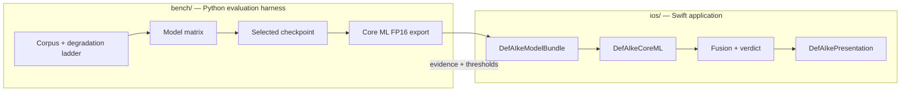

# iOS application

The on-device consumer of every result on this site: an iPhone-only app that evaluates one supported static image for evidence consistent with whole-image AI generation, entirely locally.

The benchmark work in [the harness](../engineering/harness.md) selected and converted the model. This section documents the application built around it. The app is complete as **code and tests**, and it is **not releasable** — see [current verified state](#current-verified-state) and [gaps and decisions](gaps-and-decisions.md).

!!! note "Product posture, already decided"
    Analysis runs entirely on device. The project is nonprofit, free, account-free, advertisement-free, and outside any subscription, because every enabled corpus slice is non-commercial. There is no inference server and no account system to build.

## Place in the wider project

Bench decides *what* is claimable; the app decides *whether it may claim it on this device*. The pixel model identity is pinned in Swift rather than configured: `RequiredPixelModel` in `DefAIkeDomain/ReleaseArtifacts/ModelBundleManifest.swift` carries the checkpoint string and the required weight digest as constants, so a model refresh is an auditable source edit.

## Repository layout

| Source path | Contents |
|---|---|
| `ios/DefAIkePackage/` | Swift package: 11 library modules (253 Swift files) and 11 test targets (223 Swift files) |
| `ios/DefAIkeApp/` | App target sources, 11 files: shared shell plus one per-composition `CompiledCapabilityComposition.swift` |
| `ios/DefAIkeShareExtension/` | Share Extension sources, 10 files |
| `ios/Tests/DefAIkeUITests/` | Xcode-only UI test bundle |
| `ios/Tests/DefAIkeDeviceValidationTests/` | Xcode-only device-validation bundle, run un-hosted |
| `ios/project.yml` | XcodeGen spec: targets, templates, both compositions, both schemes |
| `ios/DefAIke.xcodeproj`, `ios/DefAIke.xcworkspace` | Generated project and the workspace to open |
| `ios/Scripts/` | Host test, iOS build, project generation, five audit scripts, release pipeline |

The 11 modules are `DefAIkeDomain`, `DefAIkeApplication`, `DefAIkeImagePipeline`, `DefAIkeCoreML`, `DefAIkeModelBundle`, `DefAIkePresentation`, `DefAIkeProvenanceAPI`, `DefAIkeProvenanceC2PA`, `DefAIkeSharedTransfer`, `DefAIkeReleaseValidation`, and `DefAIkeTestSupport`, each with a matching `*Tests` target. `DefAIkeDomain` is the largest at 72 files and depends on nothing. Module boundaries and the dependency graph are [architecture.md](architecture.md).

A repository remote is not configured in this workspace, so the paths above are copyable source references rather than links to a guessed host.

## The two capability compositions

Two signed build outputs from one source tree. This is a link-time decision, never a remotely toggled flag.

| | `DefAIkeApp-PixelOnly` | `DefAIkeApp-PixelPlusProvenance` |
|---|---|---|
| Bundle identifier | `dev.defaike.app` | `dev.defaike.app.provenance` |
| `PRODUCT_NAME` | `DefAIke` | `DefAIke` |
| Package product linked | `DefAIkePixelOnly` | `DefAIkePixelPlusProvenance` |
| Content Credential validator | not linked | `DefAIkeProvenanceC2PA` linked |
| Declared capabilities | `pixelAnalysis` | `pixelAnalysis`, `contentCredentialValidation` |
| Measured C2PA symbols in archive | 0 | ~20,843, in an embedded `C2PAC.framework` |
| Measured network symbol references | 0 | — |

Both compositions build the same product name and differ only by bundle identifier, which is verifiable in `ios/project.yml` (the shared `App` target template sets `PRODUCT_NAME: DefAIke`; the per-target `appBundleID` attribute supplies the rest). That shared product name is not cosmetic — it is why the device-validation bundles run un-hosted and why archive audits need a per-invocation derived-data path.

`c2pa-swift` **is** declared, exact-pinned to `0.0.12` at `ios/DefAIkePackage/Package.swift:102-104`, and reachable from `DefAIkeProvenanceC2PA` alone.

!!! warning "Linking the validator is not enabling it"
    Both compositions' `provenanceAnalyzer(store:policy:)` currently return `nil`. In the pixel-only build that is structural — there is no validator type in the module closure. In the provenance build it is a deliberate fail-closed choice: two approvals are still owed, enumerated as values in `UnresolvedProvenanceEnablement` (`feasibility-finding-state-mapping` and `approved-offline-trust-store`). Details in [gaps-and-decisions.md](gaps-and-decisions.md).

## Current verified state

Measured in this workspace with the toolchain below.

| Check | Result |
|---|---|
| `ios/Scripts/host-test.sh` | 2,882 tests in 363 suites, 0 failures; reproduced across four sequential runs, one from a cleaned `.build` |
| Both schemes, Debug and Release | Build with zero errors |
| `xcodebuild build-for-testing`, both schemes | Succeeds; requires `CODE_SIGNING_ALLOWED=NO` |
| `check-module-boundaries.py` | Passes |
| Five audit scripts | Behave as documented; self-test probe counts 13/13, 8/8, 12/12, 8/8, 7/7, 16/16, 42/42, 28/28 |
| Design properties | 36 numbered properties, one dedicated tagged property-test file each, 40 property tests in total |
| `release-pipeline.py` | Exits 1: 15 owed release-controlled inputs, two **provisional** evidence scopes |
| `audit-release-archives.py` | Exits 1, correctly |

Both non-zero exits are the intended behaviour, not a regression: the pipeline reports what is owed and refuses to emit a non-provisional artefact while anything is missing.

### What is not established

- **No physical iPhone exists in this environment.** No latency, memory, power, or thermal measurement, and no device-validation gate can be satisfied. Host and simulator results are development checks.
- **No signed release artefacts.** Signing team, key policy, distributed build identity, device allowlist, resource budgets, and capability approval all arrive as approved artefacts, and none are installed.
- **The approved English String Catalog carries only three keys** — the three fixed pixel labels, in `DefAIkePresentation/Resources/Localizable.xcstrings`. Every other user-facing string is copy-gapped rather than approved.
- **No Core ML artefact is embedded in either built archive today.** The compiled model in the working tree, `data/coreml/commfor-lowq-384.mlmodelc`, has a 43,633,664-byte weight blob whose SHA-256 `f073f8a3…d26d4c1e` matches `RequiredPixelModel.weightDigestHexadecimal` character for character. That establishes identity agreement between the harness output and the Swift constant; it does **not** establish that the model is packaged inside the application, which cannot be shown from the built bytes.

## Toolchain

| Item | Value |
|---|---|
| Xcode | 26.6 |
| Swift | 6.3.3 |
| Installed SDK and runtime | iOS 26.5 only |
| Deployment target | iOS 17.0, iPhone-only |
| `xcode-select -p` | Points at CommandLineTools |

Because `xcode-select` points at CommandLineTools, every Xcode invocation needs `export DEVELOPER_DIR=/Applications/Xcode.app/Contents/Developer`.

!!! danger "Never delete `ios/DefAIke.xcodeproj`"
    The directory is gitignored (`ios/.gitignore:2`) yet present on disk, so it is not recoverable from source control. Regenerating it needs a working XcodeGen at the spec's `minimumXcodeGenVersion: "2.42.0"`, which has not been demonstrated in this environment — `release-pipeline.py` records XcodeGen as unavailable and treats `project.yml` as unregenerable. Deleting the project is therefore assumed irreversible.

## Where to start

| If you want to know | Read |
|---|---|
| Which module may talk to which, and where startup fails closed | [architecture.md](architecture.md) — module boundaries, ports and adapters, composition roots, fail-closed startup gates |
| What happens between an image arriving and a verdict appearing | [analysis-flow.md](analysis-flow.md) — the two ingest routes, session lifecycle, evidence lanes, fusion, terminal outcomes, cancellation, cleanup, progress |
| What the user actually sees, and what is not yet approved to say | [presentation.md](presentation.md) — Approved Verdict Copy, view-state projection, accessibility layer, disclosure screens, copy-gap vocabularies |
| How to build and test it yourself | [build-and-test.md](build-and-test.md) — toolchain, scripts, schemes, release pipeline, verification commands |
| How release evidence is produced and audited | [release-validation.md](release-validation.md) — fixture catalogue, parity/resource/accessibility runners, release-record assembly, allowlist generation, audit scripts, SBOM |
| What is broken, undecided, or unknowable here | [gaps-and-decisions.md](gaps-and-decisions.md) — open decisions, known defects, what is unverifiable in this environment |

Upstream context: the [Core ML deployment gate](../results/coreml.md) for the conversion the app consumes, the [shipping-model card](../results/shipping-model.md) for the checkpoint it pins, the [benchmark protocol](../methodology/benchmark.md) for where thresholds come from, and [project status](../status.md) for the whole-project ledger.

!!! note "`ios/README.md` is stale"
    It describes the package as "domain foundations" at spec tasks 1.1–1.4 and states that `c2pa-swift` 0.0.12 is not declared yet. Both claims are wrong against the current tree. Treat this section as authoritative and the README as a historical note.
