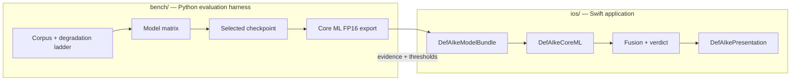

# iOS application

The on-device consumer of every result on this site: an iPhone-only app that evaluates one supported static image for evidence consistent with whole-image AI generation, entirely locally.

The benchmark work in [the harness](../engineering/harness.md) selected and converted the model. This section documents the application built around it. The app is complete as **code and tests**, and it is **not releasable** — see [current verified state](#current-verified-state) and [gaps and decisions](gaps-and-decisions.md).

!!! note "Product posture, already decided"
    Analysis runs entirely on device. The project is nonprofit, free, account-free, advertisement-free, and outside any subscription, because every enabled corpus slice is non-commercial. There is no inference server and no account system to build.

## Place in the wider project

Bench decides *what* is claimable; the app decides *whether it may claim it on this device*. The pixel model identity is pinned in Swift rather than configured: `RequiredPixelModel` in `DefAIkeDomain/ReleaseArtifacts/ModelBundleManifest.swift` carries the checkpoint string and the required weight digest as constants, so a model refresh is an auditable source edit.

## Repository layout

| Source path | Contents |
|---|---|
| `ios/DefAIkePackage/` | Swift package: 11 library modules (253 Swift files) and 11 test targets (223 Swift files) |
| `ios/DefAIkeApp/` | App target sources, 11 files: shared shell plus one per-composition `CompiledCapabilityComposition.swift` |
| `ios/DefAIkeShareExtension/` | Share Extension sources, 10 files |
| `ios/Tests/DefAIkeUITests/` | Xcode-only UI test bundle |
| `ios/Tests/DefAIkeDeviceValidationTests/` | Xcode-only device-validation bundle, run un-hosted |
| `ios/project.yml` | XcodeGen spec: the app, Share Extension, UI-test and device-validation targets, and the one scheme |
| `ios/DefAIke.xcodeproj`, `ios/DefAIke.xcworkspace` | Generated project and the workspace to open |
| `ios/Scripts/` | Host test, iOS build, project generation, five audit scripts, release pipeline |

The 11 modules are `DefAIkeDomain`, `DefAIkeApplication`, `DefAIkeImagePipeline`, `DefAIkeCoreML`, `DefAIkeModelBundle`, `DefAIkePresentation`, `DefAIkeProvenanceAPI`, `DefAIkeProvenanceC2PA`, `DefAIkeSharedTransfer`, `DefAIkeReleaseValidation`, and `DefAIkeTestSupport`, each with a matching `*Tests` target. `DefAIkeDomain` is the largest at 72 files and depends on nothing. Module boundaries and the dependency graph are [architecture.md](architecture.md).

A repository remote is not configured in this workspace, so the paths above are copyable source references rather than links to a guessed host.

## The one capability composition

One signed build output from one source tree, compiling both evidence capabilities. This is a link-time decision, never a remotely toggled flag.

| | `DefAIkeApp` |
|---|---|
| Bundle identifier | `dev.defaike.app` |
| `PRODUCT_NAME` | `DefAIke` |
| Package product linked | `DefAIkeAppKit` |
| Content Credential validator | `DefAIkeProvenanceC2PA` linked |
| Declared capabilities | `pixelAnalysis`, `contentCredentialValidation` |
| Measured C2PA symbols in archive | 18,226 in `DefAIke.debug.dylib`, plus an embedded `C2PAC.framework` |
| Measured C2PA symbols in the `.appex` | 0 |
| Measured network symbol references in the `.appex` | 0 |
| Measured URL-like strings in the `.appex` | 0, excluding the code-signing DOCTYPE URL |

This replaces two build outputs, `DefAIkeApp-PixelOnly` (`dev.defaike.app`, no validator linked) and `DefAIkeApp-PixelPlusProvenance` (`dev.defaike.app.provenance`, validator linked). The split existed so device evidence could not be pooled across capability sets; one composition means one capability set, so pooling is not representable.

The trade is worth stating plainly. "This build cannot validate Content Credentials" used to be checkable with `nm` on a shipped archive. It is not any more — the app links the adapter, and the validator is kept inactive by `ProvenanceLaneProvider.resolve(...)`, the signed Release Capability Manifest, and the startup gate. The Share Extension's `.appex` is the remaining shipping bundle whose exclusion is measurable from the bytes, and the two zeros above are what keep the app's non-zero counts a measurement rather than the only observation in a run.

`c2pa-swift` **is** declared, exact-pinned to `0.0.12` in `ios/DefAIkePackage/Package.swift`, and reachable from `DefAIkeProvenanceC2PA` alone.

!!! warning "Linking the validator is not enabling it"
    `CompiledCapabilityComposition.provenanceAnalyzer(store:policy:)` returns `nil`. That is a deliberate fail-closed choice, not an oversight: two approvals are still owed, enumerated as values in `UnresolvedProvenanceEnablement` (`feasibility-finding-state-mapping` and `approved-offline-trust-store`). The provenance lane therefore reports `validatorEnablementUnapproved` — linked, enabled by the manifest, no analyzer — which is the one unavailable reason that misstates neither the module graph nor the manifest. Details in [gaps-and-decisions.md](gaps-and-decisions.md).

## Current verified state

Measured in this workspace with the toolchain below.

| Check | Result |
|---|---|
| `ios/Scripts/host-test.sh` | 2,905 tests in 367 suites, 0 failures |
| `DefAIkeApp` scheme, Debug | Builds with zero errors, for the simulator and with signing |
| `check-module-boundaries.py --require-xcode-project` | Passes |
| `check-capability-composition.py` | Passes; `--self-test` 12/12, `--self-test-products` 5/5 |
| `check-share-extension-target.py` | Passes (no self-test mode) |
| `check-offline-privacy-archive.py` | Passes; `--self-test` 12/12, `--self-test-products` 6/6 |
| `audit-release-archives.py` | Exits 1, correctly; `--self-test` 7/7, `--self-test-archives` 16/16 |
| `release-pipeline.py` | `--self-test` 41/42, `--self-test-commands` 28/28 |
| Design properties | 36 numbered properties, one dedicated tagged property-test file each, 40 property tests in total |
| App on Simulator (iPhone 17 Pro, iOS 26.5) | Startup gate passes, a Photos ingest completes, and both lane cards render |

`audit-release-archives.py`'s non-zero exit is the intended behaviour, not a regression: it reports what is owed and refuses to emit a non-provisional artefact while anything is missing.

Two measurements need their qualifiers stated rather than buried:

- **Release configuration and `build-for-testing` were not re-measured** after the capability compositions were merged. Only Debug simulator builds were.
- **`release-pipeline.py --self-test` fails one probe of 42**, `appBuild reason names the placeholder identity`. It expects `MARKETING_VERSION`/`CURRENT_PROJECT_VERSION` to be the `0.0.0`/`0` placeholder `PLACEHOLDER_BUILD_IDENTITY` names, and `project.yml` carries `0.1.0`/`1`. Pre-existing and unrelated to the merge — verified by stashing the merge and reproducing 41/42 on the prior commit. The build identity is still not a release-approved `AppBuildID` either way, so the gate's conclusion is right and only its stated reason is wrong.
- **The App Group entitlement is stripped by `CODE_SIGNING_ALLOWED=NO`.** An app installed from such a build refuses startup with `appGroupContainerUnresolvable`, and `StartupBlockedView` renders `Color.clear`, so the symptom is a blank white screen with no diagnostic on screen. Build with signing (an ad-hoc simulator signature is enough) before installing. The refusal reaches the DEBUG console only at `log stream --level debug --predicate 'subsystem == "dev.defaike.development"'`; `log show` does not persist debug-level messages.

### What is not established

- **No physical iPhone exists in this environment.** No latency, memory, power, or thermal measurement, and no device-validation gate can be satisfied. Host and simulator results are development checks.
- **No signed release artefacts.** Signing team, key policy, distributed build identity, device allowlist, resource budgets, and capability approval all arrive as approved artefacts, and none are installed.
- **The approved English String Catalog carries only three keys** — the three fixed pixel labels, in `DefAIkePresentation/Resources/Localizable.xcstrings`. Every other user-facing string is copy-gapped rather than approved.
- **No Core ML artefact is embedded in either built archive today.** The compiled model in the working tree, `data/coreml/commfor-lowq-384.mlmodelc`, has a 43,633,664-byte weight blob whose SHA-256 `f073f8a3…d26d4c1e` matches `RequiredPixelModel.weightDigestHexadecimal` character for character. That establishes identity agreement between the harness output and the Swift constant; it does **not** establish that the model is packaged inside the application, which cannot be shown from the built bytes.

## Toolchain

| Item | Value |
|---|---|
| Xcode | 26.6 |
| Swift | 6.3.3 |
| Installed SDK and runtime | iOS 26.5 only |
| Deployment target | iOS 17.0, iPhone-only |
| XcodeGen | 2.46.0 |
| `xcode-select -p` | `/Applications/Xcode.app/Contents/Developer` |

`xcode-select` now points at Xcode, so `export DEVELOPER_DIR=…` is no longer required for an Xcode invocation. It is still harmless, and the audit scripts' documented commands keep it so they work on a machine where `xcode-select` points at CommandLineTools.

!!! note "`ios/DefAIke.xcodeproj` is generated and regenerable"
    The directory is gitignored (`ios/.gitignore:2`) yet present on disk, so it is not recoverable from source control — but it no longer needs to be. `ios/Scripts/generate-xcode-project.sh` regenerates it from `project.yml`, and this was demonstrated in this environment with XcodeGen 2.46.0, above the spec's `minimumXcodeGenVersion: "2.42.0"`. `release-pipeline.py` may still record XcodeGen as unavailable depending on how its `PATH` resolves; that is a pipeline observation, not a fact about the toolchain.

## Where to start

| If you want to know | Read |
|---|---|
| Which module may talk to which, and where startup fails closed | [architecture.md](architecture.md) — module boundaries, ports and adapters, composition roots, fail-closed startup gates |
| What happens between an image arriving and a verdict appearing | [analysis-flow.md](analysis-flow.md) — the two ingest routes, session lifecycle, evidence lanes, fusion, terminal outcomes, cancellation, cleanup, progress |
| What the user actually sees, and what is not yet approved to say | [presentation.md](presentation.md) — Approved Verdict Copy, view-state projection, accessibility layer, disclosure screens, copy-gap vocabularies |
| How to build and test it yourself | [build-and-test.md](build-and-test.md) — toolchain, scripts, schemes, release pipeline, verification commands |
| How release evidence is produced and audited | [release-validation.md](release-validation.md) — fixture catalogue, parity/resource/accessibility runners, release-record assembly, allowlist generation, audit scripts, SBOM |
| What is broken, undecided, or unknowable here | [gaps-and-decisions.md](gaps-and-decisions.md) — open decisions, known defects, what is unverifiable in this environment |

Upstream context: the [Core ML deployment gate](../results/coreml.md) for the conversion the app consumes, the [shipping-model card](../results/shipping-model.md) for the checkpoint it pins, the [benchmark protocol](../methodology/benchmark.md) for where thresholds come from, and [project status](../status.md) for the whole-project ledger.

!!! note "`ios/README.md` is stale"
    It describes the package as "domain foundations" at spec tasks 1.1–1.4 and states that `c2pa-swift` 0.0.12 is not declared yet. Both claims are wrong against the current tree. Treat this section as authoritative and the README as a historical note.
