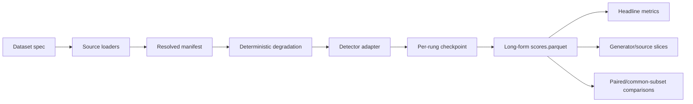

# Benchmark protocol

The benchmark answers a narrow deployment question: **at a fixed false-accusation budget, how much AI-generated content remains detectable after realistic image transformations?**

## Score and label contract

Every pixel detector emits one real-valued logit:

- positive direction means “more consistent with AI generation”;
- negative direction means “more consistent with a real image”;
- `NaN` means the provider has no valid opinion, not zero evidence;
- a detector-specific calibrated boundary is used when published and verified.

The selected lowq checkpoint's calibrated raw-logit boundary is **1.390625**. This is distinct from the frontier checkpoint's 1.359375 and must never be mixed across variants.

## Metrics

| Metric | Role | Caveat |
|---|---|---|
| `TPR@1%FPR` | **Headline** operating point under the false-accusation harm model | Conservative, non-interpolated threshold; thin real tail requires CIs |
| AUC | Threshold-free ranking | Does not prove a usable low-FPR point |
| Balanced accuracy | Natural/calibrated-threshold behavior | Depends on class-conditional threshold choice |
| FPR at threshold | Product-safety diagnostic | Logit zero is not valid for every detector |
| ECE | Confidence calibration | Only meaningful with the detector's score/probability interpretation |

Bootstrap confidence intervals are stratified by class. Full lowq/frontier deltas use **2,000 paired stratified resamples**; standard CLI headline tables default to 400.

## Evidence and coverage rules

1. Every table states its rung and coverage.
2. Cross-detector claims use only images every compared detector scored.
3. Imported ReWIND logits are labelled `AUTHOR LOGITS`; they are not described as project inference.
4. Sampled exploration is labelled `MEASURED · SAMPLE` and cannot supersede full coverage.
5. Contaminated rows are excluded in the adapter, not by analyst convention.
6. Native-resolution `clean` and `light` numbers carry a resolution-shortcut warning.

The current scores table has 314,900 rows, 15 detector labels, and 8 rungs, but coverage is heterogeneous: commfor variants have 9,582 rows per rung; most local exploratory models have 2,998; Corvi has 1,198; and six reference providers have 1,350 clean-rung rows. Comparing their raw headline rows would compare different datasets.

## Degradation rungs

All random choices are seeded from `SHA-256(image ID + rung)`, so a given image/rung pair is deterministic and parallel execution cannot change pixels or scores.

| Rung | Exact transform | Resolution shortcut? | Intended condition |
|---|---|---|---|
| `clean` | Original bytes decoded, no transform | **Survives** | Diagnostic only; never deployment headline |
| `light` | Pillow JPEG QF 95, dimensions unchanged | **Survives** | High-quality re-encode |
| `moderate` | Random one-side crop 0.94; short edge 896 (Pillow); JPEG QF 85 | Cleared | One mild repost |
| `heavy` | Crop 0.90; short edge 640 (OpenCV); JPEG QF 75 | Cleared | Repeated reposting |
| `severe` | Crop 0.75; resize 384 (OpenCV); QF 60; upscale 768 (Pillow); QF 70 | Cleared | Double compression; expected abstention |
| `thumbnail` | Crop 0.85; resize 144 (OpenCV); JPEG QF 55 | Cleared | Information loss below model input |
| `screenshot` | Scale image region to 92% of iPhone 15 Pro width (about 1084 px); lossless PNG | Cleared | Cropped image region from an iOS screenshot |
| `screenshot_shared` | Screenshot path, then Pillow JPEG QF 85 | Cleared | **Primary deployment condition** |

Two different JPEG encoders are deliberate: AncesTree's empirical process uses both Pillow and OpenCV, and their outputs differ at the same nominal QF.

### Why `thumbnail` exists

The original ladder stayed above the 224 px inputs of several detectors. Their own resize discarded the benchmark damage, making clean-to-severe AUC look artificially flat. `thumbnail` forces genuine information loss at 144 px before any model upscales it. For commfor, it also crosses the model's own 440 px resize boundary and exposes the remaining low-resolution failure.

### Screenshot simulator limitation

The screenshot path models the post-crop image region, not UI chrome, because the future app is expected to crop chrome before scoring. It uses remembered iPhone dimensions and is marked `verified_on_hardware = false`. M3 results are therefore reproducible simulator results, not proof that the simulator matches a real iPhone compositor pixel-for-pixel.

ReWIND's QF validation did match the real distribution at p10/p50/p90 (75/85/94) with KS p=0.686, but device geometry, interpolation, color management, and real screenshot statistics still require hardware validation.

## Full versus sampled runs

### Full commfor run

Each variant covers all 9,582 eligible score rows at all eight rungs. The paired delta analysis collapses duplicate IDs and therefore uses 9,569 distinct IDs. This is the authoritative model-selection evidence.

### Exploratory matrix

The earlier `--sample 3000` run stratified classes and floored each named generator at 20 rows. It produced 2,998 selected rows; commfor scored 2,662 after OpenFakeTiny exclusion. Those results found the generator-drift and low-resolution patterns, but the subsample was optimistic for frontier by about +0.014 AUC and +0.034 deployment TPR. It remains diagnostic evidence only.

## Evaluation pipeline

Scoring and metric computation are deliberately separated by `data/scores.parquet`. Expensive inference is resumable; changing a slice or bootstrap count does not require rescoring.

## M3 execution path

PyTorch adapters select Metal Performance Shaders (`mps`) when available. On this Apple M3 Pro, commfor inference measured about 9.3 ms/image on MPS versus 36.5 ms/image on CPU. The larger bottleneck was image degradation. The base adapter now overlaps Pillow/OpenCV preprocessing across eight workers while bounding in-flight images to 96; at `screenshot_shared`, this improved a 320-image run from 117.4 to 21.6 ms/image (5.42×) with bit-identical scores.

These are benchmark-pipeline timings, not iPhone deployment claims. Core ML timings and ANE placement are documented separately in [Core ML deployment gate](../results/coreml.md).

## Implemented safeguards

Regression tests cover, among other things:

- tie-corrected AUC and conservative `TPR@1%FPR` predicates;
- label sign and detector metadata;
- deterministic degradation independent of thread completion order;
- exact ReWIND path joins rather than ambiguous basenames;
- score-table merge/checkpoint behavior;
- contamination masking;
- Core ML normalization and placement verdict logic;
- parity between serial and 2/6/12-worker preprocessing.

See the [harness map](../engineering/harness.md) and [reproduction commands](../engineering/reproduce.md).
