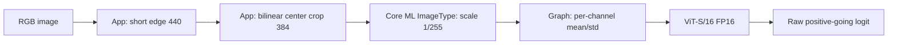

# Core ML deployment gate

<span class="evidence full">Measured · full</span>

The selected lowq checkpoint was converted to Core ML and evaluated on the Apple M3 Pro in this workspace. Conversion success alone was not the gate: the model had to place on the Apple Neural Engine and preserve PyTorch behavior.

[Download the machine-readable Core ML report.](../assets/data/coreml-lowq-report.json)

## Result

| Check | Result |
|---|---|
| Source checkpoint | `Thermostatic/community-forensics-low-quality-detector-2026-08` |
| Format | FP16 `mlprogram`, minimum deployment target iOS 17 |
| Conversion time | 3.6 s |
| `.mlpackage` size | 43,744,071 bytes (43.7 MB) |
| Compiled `.mlmodelc` size | 43,764,661 bytes (43.8 MB) |
| Weight blob SHA-256 | `f073f8a325f63e35ef0668c985ac762486a1b50e57dcf5ae33d4647bd26d4c1e` |
| Assigned operations | 264 |
| ANE-preferred operations | **262 (99.2%)** |
| CPU-preferred operations | 2 (`ios17.mul`, `ios17.cast`) |
| Parity fixtures | 96 |
| Max absolute logit delta | 0.13058 |
| Mean absolute logit delta | 0.03698 |
| Systematic bias | +0.02884 |
| Spearman rank correlation | **0.999949** |
| Decisions agreeing at 1.390625 | **96/96 (100%)** |

!!! success "Gate verdict"
    **Pass—essentially fully on ANE.** The two CPU operations are lightweight input normalization/cast operations. Transformer inference itself places on the Neural Engine.

## Why placement is measured directly

A Core ML model can compile and produce correct outputs while silently assigning unsupported operations to CPU. Accuracy and parity would still pass, but latency, energy, and thermal behavior on a phone could fail. `bench/coreml.py` compiles the package to `.mlmodelc`, loads `MLComputePlan`, and queries `get_compute_device_usage_for_mlprogram_operation` for every operation.

This is stronger evidence than inferring ANE use from a stopwatch. It answers the transferable binary question—whether the graph can use ANE—even though M3 Pro milliseconds do not transfer to an iPhone.

## Parity

The parity path first applies the exact Python resize and center crop, then sends identical 384×384 RGB crops through:

- the original PyTorch model with torchvision normalization;
- the FP16 Core ML model with normalization embedded in the graph.

AUC depends on rank, so Spearman ρ = 0.999949 is the relevant aggregate. At the checkpoint's calibrated boundary, every one of 96 fixtures made the same binary decision. The +0.02884 mean bias is small but not ignored: any final abstention band should be at least the observed ±0.131 max-drift envelope.

Across all current lowq scores, 1.55% lie within ±0.131 of the calibrated boundary and 0.46% lie within ±0.037. A future calibrated band wider than the conversion envelope makes FP16-induced verdict changes irrelevant by construction.

## M3 Pro latency

These are warmed relative measurements on the same Mac and input, **not iPhone performance claims**:

| Compute units | ms/image | Relative to CPU-only |
|---|---:|---:|
| CPU only | 16.84 | 1.00× |
| CPU + GPU | 12.86 | 1.31× faster |
| CPU + Neural Engine | **9.33** | **1.80× faster** |
| All | 9.35 | 1.80× faster |

Measured environment:

```text
Hardware:        Apple M3 Pro, 18-core GPU
Python:          3.12.12 (arm64)
coremltools:     9.0
PyTorch:         2.13.0
Torchvision:     0.28.0
Timm:            1.0.28
MPS available:   true
```

`coremltools 9.0` warns that PyTorch 2.13 is newer than its tested range (2.7 at the time of conversion). That warning increases the importance of measured parity; it is not evidence of a failure by itself.

## Conversion architecture



Normalization stays inside the graph because Core ML's image input supports one scalar scale, while ImageNet standard deviation differs by channel. Resize and crop stay outside because short-edge aspect-preserving resize is variable-shape logic and must be shared with the app's image pipeline.

## Reproduce

```bash
bench coreml --variant lowq --force --parity-n 96
```

That command exports, compiles, reports per-op placement, runs parity, and prints relative compute-unit latency. The generated package and compiled model live under ignored `data/coreml/`; the small report served here is the publishable record.

## Still open

- No int8 conversion was attempted; FP16 already fits the current size target.
- No tethered-iPhone Core ML Performance Report exists.
- No iPhone score parity, extension memory, power, thermal, or cold-load measurement exists.
- The future app must pin interpolation, orientation, color-space handling, crop, and normalization as a versioned bundle contract.
- The final downloadable model bundle and integrity manifest have not been produced.

See [Reproduce the work](../engineering/reproduce.md) and [Shipping model card](shipping-model.md).
